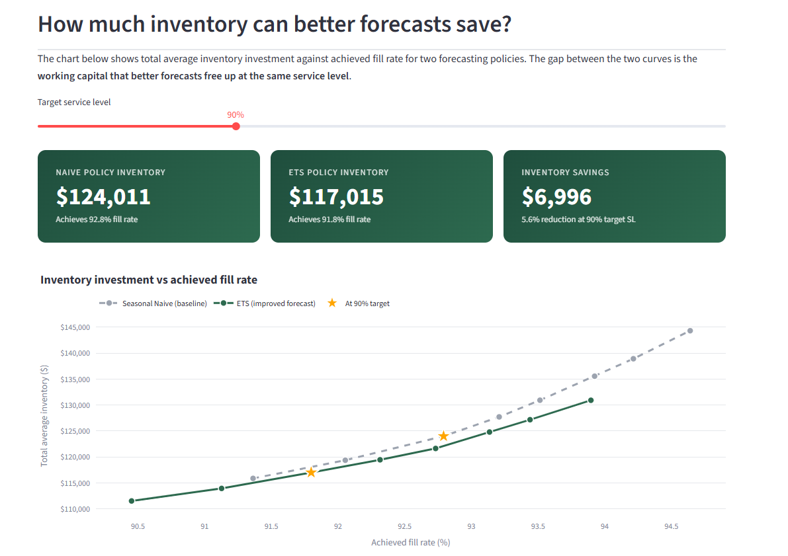

# Forecast-to-Inventory

**Quantifying how much working capital better demand forecasts actually free up.**

🚀 **[Live interactive dashboard →](https://forecast-to-inventory-rcharmy.streamlit.app/)**



---

## The business question

Better demand forecasts should mean less inventory at the same service level — but **how much less, and is the difference worth the modeling complexity?**

This project answers that question empirically. Using ~1,400 SKUs of Walmart retail sales data, I built four forecasting models, derived safety stock policies from their forecast error distributions, and ran a day-by-day inventory simulation comparing the resulting working capital requirements.

## Headline result

At a **95% target service level** across a 1,437-SKU FOODS catalog over a 28-day test period:

| | Seasonal naive (baseline) | ETS (improved forecast) | Improvement |
|---|---|---|---|
| Forecast error σ per SKU (mean) | 2.34 units | 1.66 units | **−29%** |
| Total average inventory | $130,942 | $121,648 | **−$9,294 (−7.1%)** |

A 29% reduction in forecast error standard deviation translated to a 7.1% reduction in working capital tied up in inventory — driven by lower safety stock requirements while maintaining the same service level.

**Why the inventory gain is smaller than the σ gain:** Total inventory = cycle stock (set by order quantity, unaffected by forecast quality) + safety stock (set by σ). With a 4-week order cycle, cycle stock dominates total inventory, dampening the percentage transmission from σ to total inventory. This is a real and intuitive supply chain finding, not a project limitation.

## Where the value concentrates

The aggregate 7.1% savings hides important variation:

- **Smooth SKUs** (predictable demand) — large per-SKU savings from better forecasts
- **Erratic SKUs** (regular but variable) — moderate savings
- **Lumpy SKUs** (rare spikes, intrinsically random) — near-zero savings; the two curves overlap

This decomposition matters for prioritization. A real planning team should invest in better forecasting for smooth and erratic SKUs, and use different policies entirely (higher safety stock, pooled stocking, longer review cycles) for lumpy ones. Chasing forecast accuracy on lumpy SKUs is a waste of effort.

## Methodology

**Data:** [M5 Forecasting competition dataset](https://www.kaggle.com/competitions/m5-forecasting-accuracy) — Walmart daily sales, 1,941 days (Jan 2011 – May 2016). Scope: FOODS category at store CA_1 → 1,437 SKUs.

**Pipeline:**

1. **EDA and demand pattern classification** ([`notebooks/01_eda.ipynb`](notebooks/01_eda.ipynb))
   Classified SKUs using a Syntetos-Boylan-style framework: smooth, erratic, intermittent, lumpy. Identified key demand drivers: weekly seasonality, SNAP-CA days (12% lift on food-stamp distribution days), new-SKU introductions.

2. **Forecasting** ([`notebooks/02_forecasting.ipynb`](notebooks/02_forecasting.ipynb))
   Built and compared four models on a 28-day held-out test set:
   - Seasonal naive (one-week lag) — baseline
   - Exponential smoothing (ETS) with weekly seasonality, fit per SKU
   - LightGBM global model with lag features, rolling means, day-of-week, SNAP, and price
   - Evaluated with WMAPE, bias, and RMSE — broken down by demand pattern, because aggregate metrics hide where models win and lose.

3. **Safety stock and inventory simulation** ([`notebooks/03_inventory_simulation.ipynb`](notebooks/03_inventory_simulation.ipynb))
   Computed forecast error σ per SKU from the validation period (the 28 days *before* the test window — mirrors how a planner sizes safety stock in practice). Derived reorder points for 8 service levels (80%–99%) using SS = z × σ × √L (L = 7 day lead time). Ran a day-by-day simulation tracking inventory, stockouts, and reorder events under each policy.

4. **Interactive dashboard** ([`dashboard/`](dashboard/))
   Streamlit app with three views: the money chart with live service-level selection, a per-SKU explorer (history + test-period forecasts + accuracy metrics), and a pattern deep-dive showing where forecast improvements concentrate.

## Forecasting results

| Pattern | Naive WMAPE | ETS WMAPE | LightGBM WMAPE | Best |
|---|---|---|---|---|
| Smooth | 54.1% | 44.6% | 44.9% | ETS/LGB tie |
| Erratic | 91.7% | 76.9% | 80.4% | ETS |
| Intermittent | 69.1% | 103.3% | 72.8% | Naive |
| Lumpy | 131.1% | 110.0% | 137.9% | ETS |
| **Overall** | **73.3%** | **61.4%** | **63.6%** | **ETS** |

A genuinely instructive finding: **the best model depends on the demand pattern**. ETS won overall in this slice because erratic SKUs make up 68% of observations, and ETS dominates there. But on intermittent SKUs, seasonal naive — the simplest possible model — outperforms both ETS and LightGBM. In production, a hybrid policy (different models for different patterns) would likely yield further gains.

## Key caveats — what I'd address in a more rigorous follow-up

A senior supply chain analyst would push on these, and I'd want to as well:

- **The √L safety stock formula assumes independent daily forecast errors.** In reality errors are autocorrelated; a bootstrap convolution would more accurately size lead-time error variance.
- **Normally distributed forecast errors.** The z × σ formula assumes Gaussian errors. For lumpy SKUs, errors are heavily right-skewed; empirical quantile-based safety stock would be more defensible.
- **Lost-sales assumption is conservative.** A backorder assumption would yield lower inventory at the same fill rate.
- **Single lead time across all SKUs.** Real supply chains have supplier-specific lead times.
- **Order quantity is heuristic, not optimized.** A proper EOQ calculation incorporating holding cost and ordering cost would re-balance cycle stock vs. safety stock.
- **Realized fill rate ≠ target service level.** The simulation's achieved fill rate over 28 days doesn't perfectly match the policy's target. They are correlated but not equal, particularly under lost-sales accounting.

## Tech stack

`pandas` · `numpy` · `statsmodels` · `scikit-learn` · `lightgbm` · `plotly` · `streamlit` · deployed on Streamlit Community Cloud.

## Project structure
```bash
forecast-to-inventory/
├── dashboard/              # Streamlit app (deployed)
├── notebooks/
│   ├── 00_data_check.ipynb     # data sanity check
│   ├── 01_eda.ipynb            # demand patterns, seasonality, SNAP
│   ├── 02_forecasting.ipynb    # naive, ETS, LightGBM
│   └── 03_inventory_simulation.ipynb  # safety stock + day-by-day sim
├── src/
│   └── metrics.py          # WMAPE, bias, RMSE
├── data/
│   ├── raw/                # gitignored — see data/README.md for download
│   └── processed/          # parquet files used by dashboard
├── results/figures/        # charts
├── requirements.txt
└── README.md
```

## Running locally

```bash
git clone https://github.com/Rcharmy/Forecast-to-Inventory.git
cd Forecast-to-Inventory
python -m venv venv
venv\Scripts\activate     # Windows
pip install -r requirements.txt

# To run the dashboard:
streamlit run dashboard/app.py

# To reproduce the analysis end-to-end:
# 1. Download M5 data from Kaggle into data/raw/ (see data/README.md)
# 2. Run notebooks in order: 00 → 01 → 02 → 03
```

## About

Built by **Charmy Raj**! Open to feedback, questions, or just chatting about demand forecasting and inventory optimization.

📧 charmyraj4@gmail.com
🔗 [GitHub](https://github.com/Rcharmy) · [Live dashboard](https://forecast-to-inventory-rcharmy.streamlit.app/)